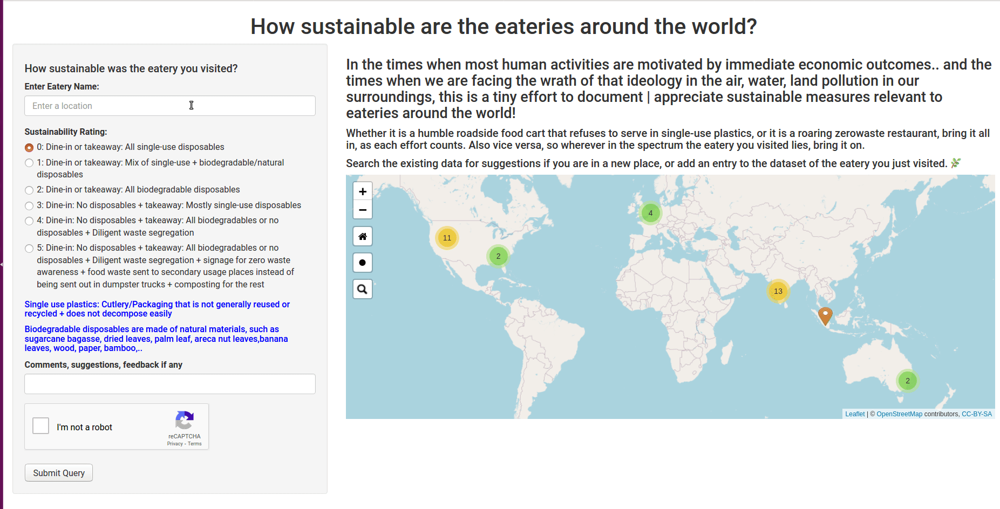

Shiny WebApp With Form & Leaflet Map
================

* The project now has a domain name too: sustainableeateries.com/

This repo contains the code to make a webapp using R Shiny with the
following features: 
  1. Form that feeds data to google sheets 
  2. Use of Google Maps APIs in the form fields (autocomplete, geocoding) 
  3. Leaflet to plot data from sheets: 
    + Clusters for larger data 
    + Searching through data 
    + Marker colors by variables 
  4. Recaptcha for security

Stepwise building of the webapp has been explained in this [blog post](https://nirzaree.wordpress.com/2020/10/11/building-a-webapp-for-data-collection-visualization-using-r-shiny/).

Steps to get the code running:     
  1. If you require any google maps api keys, then
make a google maps account and generate the keys and enter them in the
required locations in the code.    
  2. If you use google sheets for data
entry, then make a .secret folder in the same directory as the app file
and then force authentication once for the project to make sure the
token is cached there.   
  3. If you require recaptcha, then generate your
keys (site key and secret key) from
<https://www.google.com/recaptcha/about/>

Additionally, if you would like to contribute data about how sustainable are eateries around you, check the webapp live at http://18.223.166.120/

 

I am also looking for collaborators for this project to work on some more features so do reach out if the idea enthused some interest. Also, for any other feedback or comments, reach out at nirzaree[dot]svnit[at]gmail[dot]com.

Adios! ✨ 
